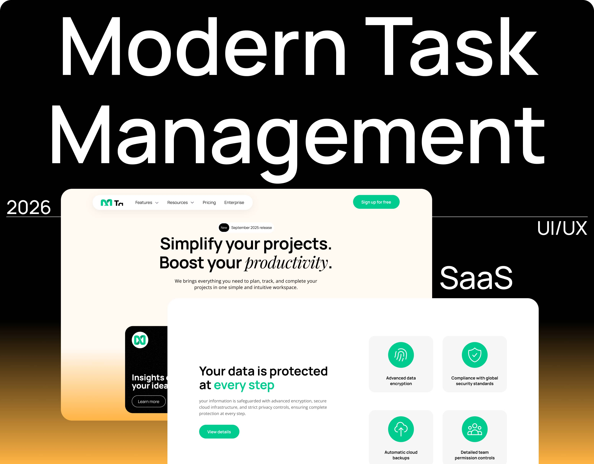
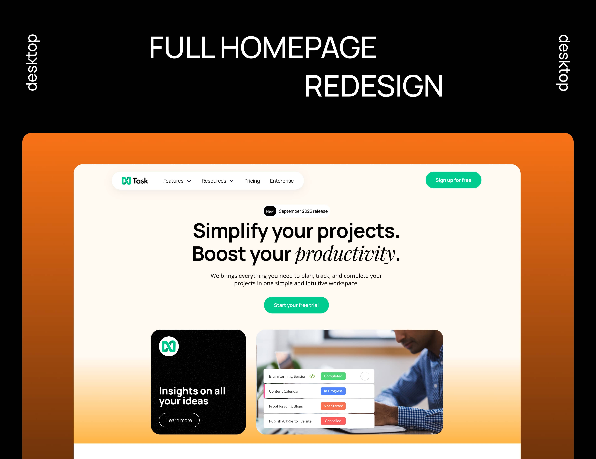
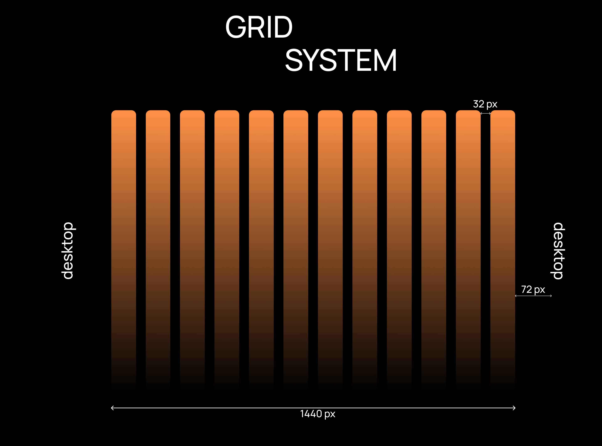
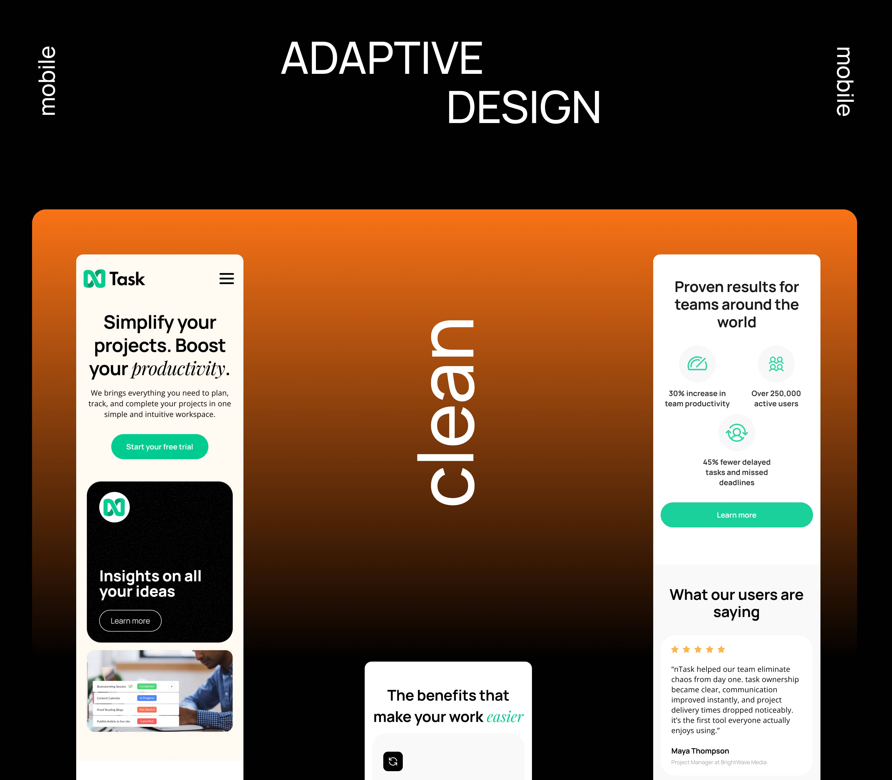
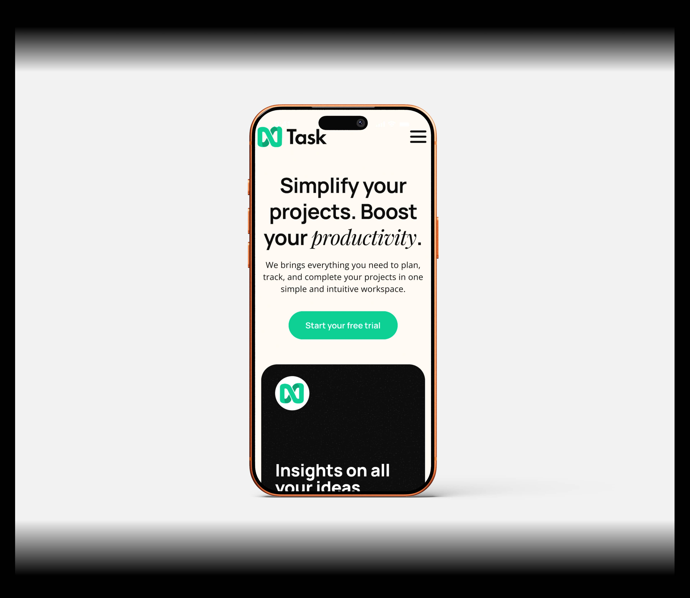
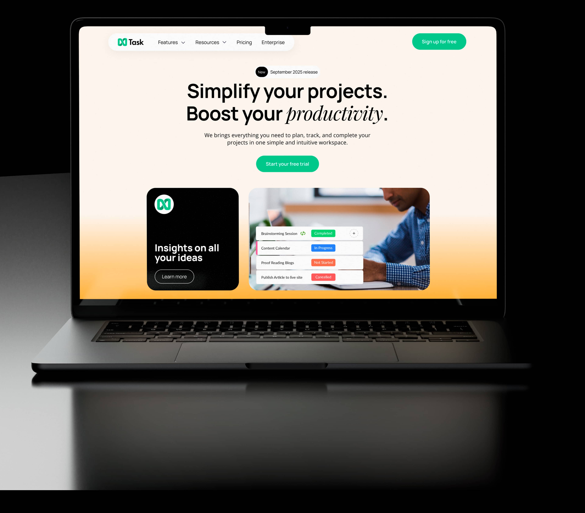

# SaaS Task Management Landing Page UI/UX Design

Redesigned a SaaS landing page for a task management platform focused on improving clarity, visual hierarchy, and user engagement. Created a clean, conversion-focused interface with better content organization, modern typography, responsive layouts, and clearer CTAs to help users understand the product faster and navigate the page more easily.

## Goals

- Improve visual hierarchy
- Create a cleaner SaaS experience
- Increase usability and engagement
- Build a modern conversion-focused layout
- Improve navigation clarity

## Tools

- Figma
- Webflow
- Photoshop

## Key Features

- Responsive layout
- Modern SaaS typography
- Structured content sections
- Conversion-focused UI
- Mobile-friendly design
- Clear CTA hierarchy

## Preview

### Cover Design

### Homepage Redesign

### Grid System

### Mobile Version

### Mobile View

### Laptop View

